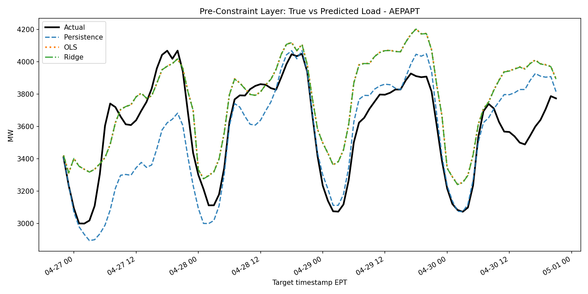
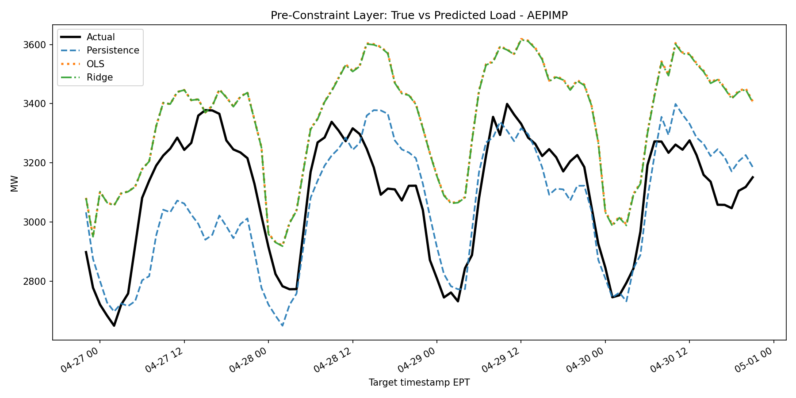
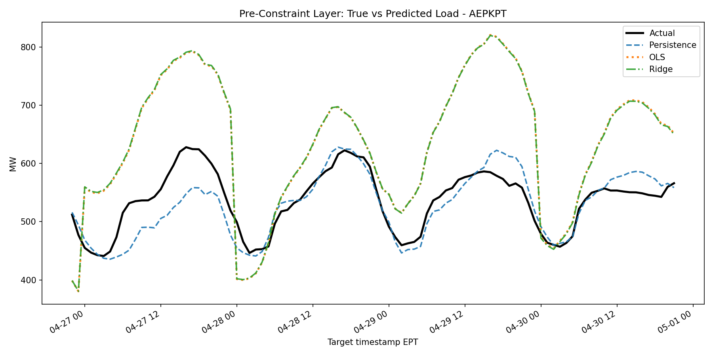
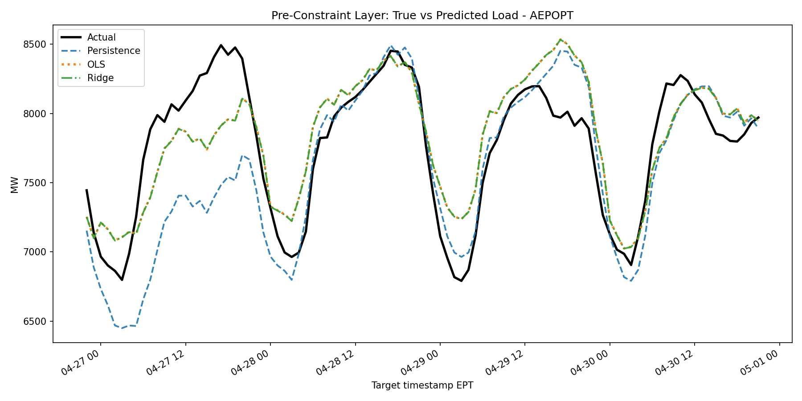
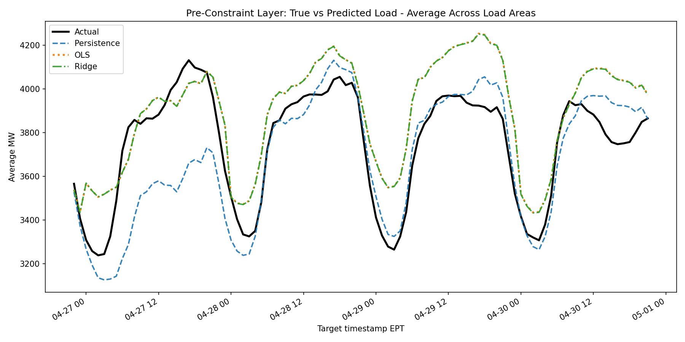
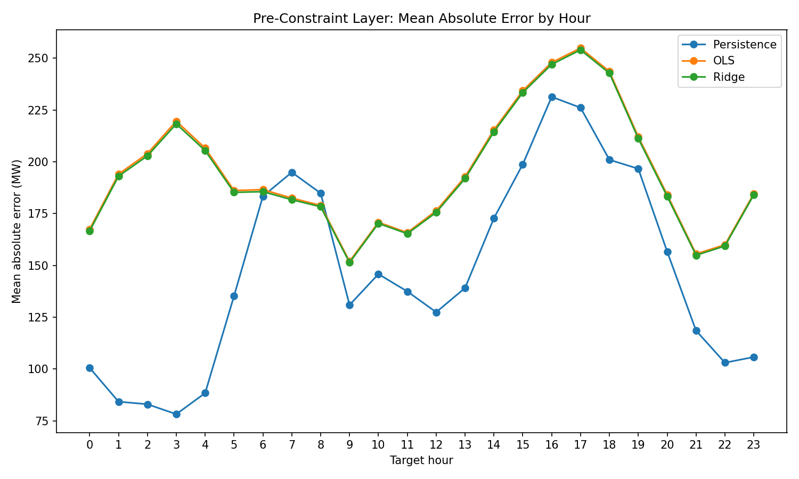
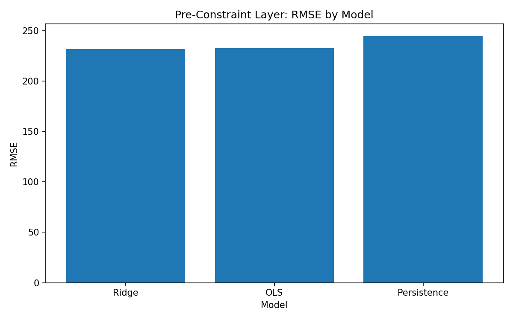
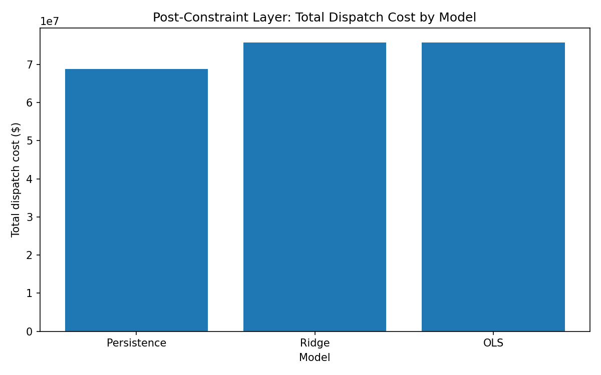
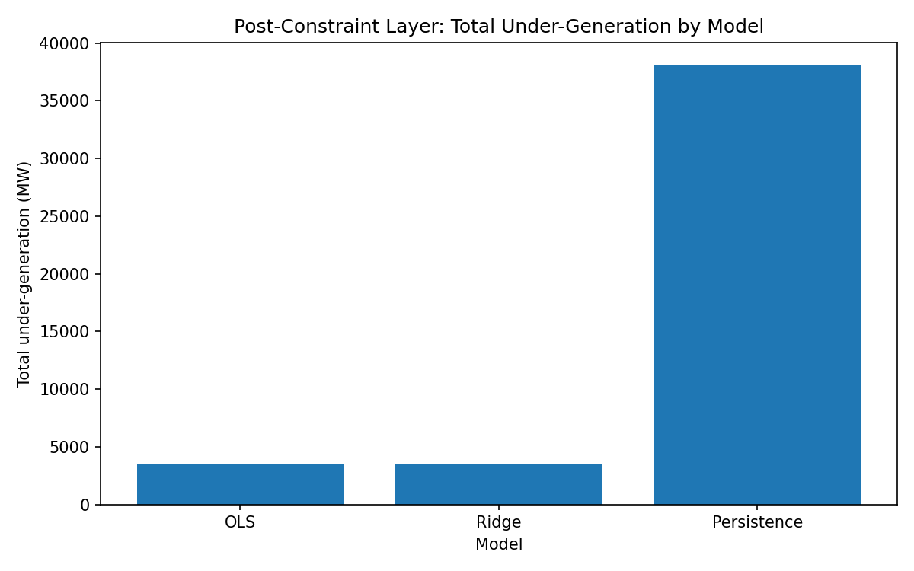
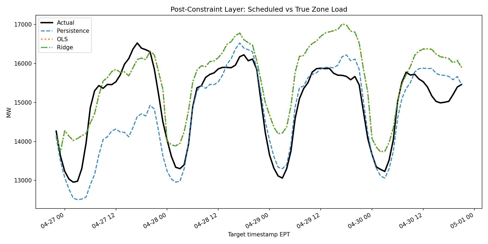

# Milestone Summary

## Simple Overview

This repo is a small energy-demand forecasting project. It uses hourly PJM load data for the AEP zone and predicts electricity demand 24 hours ahead.

The project compares three forecasting models:

- Persistence
- Ordinary Least Squares regression
- Ridge regression

After forecasting, the project adds a simple constraint layer. This layer pretends that the forecast is used to schedule electricity generation from a synthetic generator fleet. That makes it possible to compare the models in two ways:

- Pre-constraint layer: Which model predicts demand most accurately?
- Post-constraint layer: What happens when each model's forecast is used to schedule generation?

In simple terms, this repo asks:

> If we forecast electricity demand using different models, which model gives the best forecast, and which model leads to the best operational result after generation constraints are applied?

## What The Repo Contains

The main input data is:

```text
data/hrl_load_metered.csv
```

Each row represents one hourly load measurement for one AEP load area. The dataset contains four load areas:

- AEPAPT
- AEPIMP
- AEPKPT
- AEPOPT

The main code is in:

```text
src/
```

Important files:

- `src/data.py`: loads, cleans, and validates the raw PJM data.
- `src/features.py`: creates time, lag, and rolling-window features.
- `src/split.py`: creates chronological train/validation/test splits.
- `src/models.py`: trains Persistence, OLS, and Ridge models.
- `src/evaluate.py`: computes forecasting error metrics.
- `src/operational.py`: aggregates load-area predictions to zone-level forecasts.
- `src/constraints.py`: creates the synthetic generator fleet and runs constrained dispatch.
- `src/plots.py`: creates the pre-constraint and post-constraint figures.
- `src/run_milestone.py`: runs the full pipeline.

The generated outputs are in:

```text
results/milestone/
```

## Dataset And Experimental Scope

The raw input file contains the following columns:

```text
datetime_beginning_utc
datetime_beginning_ept
nerc_region
mkt_region
zone
load_area
mw
is_verified
```

After cleaning, the pipeline keeps these standardized columns:

```text
timestamp_utc
timestamp_ept
nerc_region
market_region
zone
load_area
load_mw
is_verified
```

The cleaning procedure is:

1. Strip whitespace and lowercase the raw column names.
2. Parse `datetime_beginning_utc` into `timestamp_utc`.
3. Parse `datetime_beginning_ept` into `timestamp_ept`.
4. Rename `mkt_region` to `market_region`.
5. Rename `mw` to `load_mw`.
6. Convert `load_mw` to numeric values.
7. Convert `is_verified` to boolean values.
8. Strip whitespace from text columns.
9. Keep only rows where `zone == "AEP"`.
10. Drop rows missing `timestamp_utc`, `timestamp_ept`, `load_area`, `zone`, or `load_mw`.
11. Drop duplicate rows by `timestamp_utc`, `zone`, and `load_area`.
12. Sort rows by `timestamp_utc` and `load_area`.

The cleaned dataset used in this milestone has:

| Quantity | Value |
|---|---:|
| Cleaned rows | 2,880 |
| Unique hourly timestamps | 720 |
| Zone | AEP |
| Market region | WEST |
| NERC region | RFC |
| Load areas | AEPAPT, AEPIMP, AEPKPT, AEPOPT |
| Rows per load area | 720 |
| UTC timestamp range | 2026-04-01 04:00:00 to 2026-05-01 03:00:00 |
| Verified rows | All rows are verified |
| Duplicate rows after cleaning | 0 |

The project is limited to this one-month AEP load dataset. It does not use weather data, real generator data, real fuel cost data, real LMP data, or external market price data.

## Pipeline Process

The full milestone pipeline works like this:

1. Load the raw PJM load data.
2. Clean the data and keep the AEP zone.
3. Create supervised learning rows for 24-hour-ahead forecasting.
4. Split the data chronologically into train, validation, and test sets.
5. Train and evaluate the three forecasting models.
6. Save pre-constraint forecast metrics and plots.
7. Aggregate load-area forecasts into total AEP zone forecasts.
8. Create a synthetic generator fleet.
9. Dispatch generation based on each model's zone-level forecast.
10. Compare post-constraint operational results.

The chronological split used in the current run is:

| Split | Rows | Unique timestamps |
|---|---:|---:|
| Train | 1,812 | 453 |
| Validation | 388 | 97 |
| Test | 392 | 98 |

The feature-engineered dataset has 2,592 rows after dropping rows with missing lag, rolling-window, or 24-hour-ahead target values. The test set contains 392 load-area predictions per model, equal to 98 target hours times 4 load areas.

## Forecasting Setup

The supervised learning target is 24-hour-ahead load for the same load area:

```text
y_t = load_mw at time t + 24 hours
```

The model input row uses information available at time `t`:

```text
x_t = features built from time t and past load values
```

So each model learns or applies:

```text
predicted_load_mw(t + 24) = f(x_t)
```

The exact feature columns used are:

| Feature | Meaning |
|---|---|
| `load_area` | Categorical load-area label: AEPAPT, AEPIMP, AEPKPT, or AEPOPT |
| `hour` | Hour of day from the EPT timestamp |
| `day_of_week` | Day of week from the EPT timestamp, where Monday is 0 |
| `month` | Calendar month from the EPT timestamp |
| `is_weekend` | 1 if the day is Saturday or Sunday, otherwise 0 |
| `sin_hour` | Sine encoding of hour: `sin(2*pi*hour/24)` |
| `cos_hour` | Cosine encoding of hour: `cos(2*pi*hour/24)` |
| `sin_day_of_week` | Sine encoding of day of week: `sin(2*pi*day_of_week/7)` |
| `cos_day_of_week` | Cosine encoding of day of week: `cos(2*pi*day_of_week/7)` |
| `load_mw` | Current load at time `t` |
| `load_lag_1` | Load from 1 hour before time `t` |
| `load_lag_24` | Load from 24 hours before time `t` |
| `load_lag_48` | Load from 48 hours before time `t` |
| `rolling_mean_24` | 24-hour rolling mean of load for the same load area |
| `rolling_std_24` | 24-hour rolling standard deviation of load for the same load area |

The categorical feature `load_area` is one-hot encoded. The numeric features are standardized before OLS and Ridge are fit.

The pre-constraint forecast comparison is performed at the load-area level. The post-constraint dispatch comparison is performed at the AEP zone level after summing the four load-area forecasts for each target hour.

## Models

### Persistence

Persistence is the baseline model. It predicts that the load 24 hours from now will be equal to the current load.

This is simple, but it is useful because any more complex model should ideally beat it.

Formula:

```text
y_hat(t + 24) = load_mw(t)
```

### Ordinary Least Squares

Ordinary Least Squares, or OLS, is a linear regression model. It learns a linear relationship between the input features and the future load.

Formula:

```text
y_hat_i = beta_0 + beta_1*x_i1 + beta_2*x_i2 + ... + beta_p*x_ip
```

OLS chooses the coefficients that minimize the sum of squared errors:

```text
minimize sum_i (y_i - y_hat_i)^2
```

The OLS model in this repo is fit with scikit-learn `LinearRegression` after preprocessing. The one-hot encoded load-area columns and standardized numeric columns form the final design matrix.

In this repo, OLS uses all of these model inputs:

- One-hot encoded `load_area`
- Standardized `hour`
- Standardized `day_of_week`
- Standardized `month`
- Standardized `is_weekend`
- Standardized `sin_hour`
- Standardized `cos_hour`
- Standardized `sin_day_of_week`
- Standardized `cos_day_of_week`
- Standardized `load_mw`
- Standardized `load_lag_1`
- Standardized `load_lag_24`
- Standardized `load_lag_48`
- Standardized `rolling_mean_24`
- Standardized `rolling_std_24`

### Ridge Regression

Ridge regression is also a linear regression model, but it adds regularization. Regularization discourages the model from relying too heavily on any one feature.

This can help reduce overfitting and make predictions more stable.

Formula:

```text
y_hat_i = beta_0 + beta_1*x_i1 + beta_2*x_i2 + ... + beta_p*x_ip
```

Ridge chooses coefficients by minimizing squared error plus a coefficient penalty:

```text
minimize sum_i (y_i - y_hat_i)^2 + alpha * sum_j beta_j^2
```

The repo tests these Ridge alpha values:

```text
0.01, 0.1, 1.0, 10.0, 100.0
```

The best validation alpha in the current run is:

```text
alpha = 0.01
```

The selected Ridge model is then evaluated once on the held-out chronological test set.

## Error Metrics

The pre-constraint layer measures forecast accuracy.

For the formulas below:

```text
y_i = true load
y_hat_i = predicted load
n = number of predictions
```

For pre-constraint metrics in the current run, `n = 392` for each model because evaluation is performed over all test load-area rows.

### MAE

Mean Absolute Error measures the average size of the prediction error in MW.

Lower is better.

Formula:

```text
MAE = (1/n) * sum_i |y_hat_i - y_i|
```

### RMSE

Root Mean Squared Error also measures prediction error in MW, but it penalizes large errors more strongly than MAE.

Lower is better.

Formula:

```text
RMSE = sqrt((1/n) * sum_i (y_hat_i - y_i)^2)
```

### MAPE

Mean Absolute Percentage Error measures average error as a percentage of true load.

Lower is better.

Formula:

```text
MAPE = (100/n) * sum_i |(y_i - y_hat_i) / y_i|
```

### Bias

Bias measures whether the model tends to over-predict or under-predict.

- Positive bias means the model usually predicts too high.
- Negative bias means the model usually predicts too low.
- Bias close to zero is usually better.

Formula:

```text
Bias = (1/n) * sum_i (y_hat_i - y_i)
```

### Error By Hour

The error-by-hour table groups predictions by model and target hour of day. For each model-hour pair, it computes:

```text
mean_abs_error = mean(|predicted_load_mw - true_load_mw|)
mean_error = mean(predicted_load_mw - true_load_mw)
rmse = sqrt(mean((predicted_load_mw - true_load_mw)^2))
```

## Constraint Layer

The post-constraint layer turns each model's forecast into a generation schedule.

The generator fleet is synthetic. The original PJM data does not include real cost data, fuel costs, or electricity prices.

The synthetic fleet is:

| Generator | Capacity | Cost |
|---|---:|---:|
| cheap_base | 35% of max zone load | $25/MWh |
| mid_cost | 35% of max zone load | $50/MWh |
| high_cost | 35% of max zone load | $85/MWh |
| peaker | 25% of max zone load | $150/MWh |

Dispatch uses the cheapest generator first, then the next cheapest, and so on.

The fleet is sized from the maximum true AEP zone load observed in the zone-level test-period dispatch input. Total synthetic capacity is:

```text
0.35 + 0.35 + 0.35 + 0.25 = 1.30
```

or 130% of the maximum observed true zone load used for dispatch.

For each generator `g`, dispatch follows:

```text
generation_g = min(max_mw_g, remaining_demand)
remaining_demand = remaining_demand - generation_g
```

The dispatch cost for one hour is:

```text
dispatch_cost = sum_g generation_g * cost_per_mwh_g
```

The post-constraint layer is not measuring pure forecast accuracy. It measures operational effects after forecasts are used to schedule generation.

Important post-constraint metrics:

- Under-generation: how much scheduled generation falls short of true load.
- Over-generation: how much scheduled generation exceeds true load.
- Dispatch cost: synthetic cost of the scheduled generation.
- Oracle dispatch cost: synthetic cost if the true load had been known perfectly.
- Cost gap: forecast-driven dispatch cost minus oracle dispatch cost.
- Feasibility: whether the forecast demand could be served by the synthetic fleet.

Post-constraint formulas:

```text
scheduled_generation_mw = total generation dispatched to meet predicted_zone_load_mw
oracle_generation_mw = total generation dispatched to meet true_zone_load_mw
under_generation_mw = max(0, true_zone_load_mw - scheduled_generation_mw)
over_generation_mw = max(0, scheduled_generation_mw - true_zone_load_mw)
cost_gap = dispatch_cost - oracle_dispatch_cost
zone_error_after_dispatch_mw = scheduled_generation_mw - true_zone_load_mw
```

Feasibility for a forecast means:

```text
scheduled_generation_mw >= predicted_zone_load_mw
```

within a small numerical tolerance of `1e-6`.

For post-constraint metrics in the current run, `n_hours = 98` for each model because the four load-area predictions are aggregated into one AEP zone forecast for each test target hour.

## Results

### Pre-Constraint Forecast Accuracy

| Model | MAE | RMSE | MAPE | Bias |
|---|---:|---:|---:|---:|
| Persistence | 145.99 | 244.39 | 3.99% | -64.34 |
| OLS | 194.39 | 232.69 | 9.18% | 144.62 |
| Ridge | 193.57 | 231.80 | 9.15% | 143.59 |

Ridge has the lowest RMSE. Persistence has the lowest MAE and MAPE, but it has negative bias, meaning it tends to under-predict.

The pre-constraint results should be read as load-area forecast accuracy. Ridge has the best RMSE in this run, while Persistence has the best MAE and MAPE. This means the ranking depends on which error criterion is emphasized. Persistence's negative bias is important because under-prediction can create reliability risk after forecasts are used for dispatch.

### Post-Constraint Operational Results

| Model | Under-Generation Rate | Total Under-Generation MW | Total Over-Generation MW | Total Dispatch Cost | Total Cost Gap |
|---|---:|---:|---:|---:|---:|
| Persistence | 55.10% | 38,130.60 | 12,910.21 | $68,785,123.09 | -$2,143,733.06 |
| OLS | 13.27% | 3,499.94 | 60,190.56 | $75,747,559.11 | $4,818,702.95 |
| Ridge | 13.27% | 3,524.01 | 59,812.85 | $75,713,408.11 | $4,784,551.96 |

Persistence has the lowest dispatch cost, but that is partly because it under-forecasts and schedules less generation. This creates much more under-generation.

OLS and Ridge have higher dispatch costs because they schedule more generation. They create much less under-generation, but more over-generation.

The main takeaway is that the cheapest model is not automatically the best model. Forecast accuracy and operational reliability need to be considered together.

All three models are feasible for forecast dispatch in all 98 test hours. The cost values are synthetic because the generator costs are assumed by the milestone constraint layer. They should not be interpreted as real PJM operating costs.

The post-constraint results show a clear tradeoff. Persistence has the lowest total dispatch cost and a negative total cost gap, but this occurs with a 55.10% under-generation rate and 38,130.60 MW of total under-generation. OLS and Ridge have much lower under-generation rates of 13.27%, but they schedule more generation, which increases synthetic dispatch cost and total over-generation.

Among OLS and Ridge, Ridge has slightly lower total dispatch cost, lower total over-generation, and slightly lower post-dispatch RMSE, while OLS has slightly lower total under-generation. The difference between OLS and Ridge is small relative to the difference between either regression model and Persistence in under-generation.

## Interpretation Limits

This milestone does not define one combined objective that collapses forecast accuracy, dispatch cost, under-generation, and over-generation into a single score. The combined summary table reports these quantities side by side so the tradeoff is visible.

The dispatch-cost results are scenario-based results under the synthetic generator fleet. They are valid for comparing model behavior under the stated assumptions, but they are not estimates of actual PJM system cost.

The dataset covers one month of hourly load data for one zone. The results should therefore be interpreted as a milestone experiment on this dataset, not as a general conclusion about all PJM zones, all seasons, or all load-forecasting settings.

## Reproducible Output Files

The main result tables are:

| File | Purpose |
|---|---|
| `results/milestone/metrics/pre_constraint_layer_forecast_metrics.csv` | Forecast metrics by model |
| `results/milestone/metrics/pre_constraint_layer_forecast_metrics_by_load_area.csv` | Forecast metrics by model and load area |
| `results/milestone/metrics/pre_constraint_layer_error_by_hour.csv` | Forecast error by model and target hour |
| `results/milestone/predictions/pre_constraint_layer_test_predictions.csv` | Load-area test predictions |
| `results/milestone/predictions/pre_constraint_layer_zone_predictions.csv` | Zone-level forecast inputs to dispatch |
| `results/milestone/metrics/post_constraint_layer_generator_fleet.csv` | Synthetic generator fleet |
| `results/milestone/predictions/post_constraint_layer_dispatch_hourly.csv` | Hourly dispatch results by model |
| `results/milestone/metrics/post_constraint_layer_dispatch_metrics.csv` | Post-constraint operational metrics by model |
| `results/milestone/metrics/pre_post_constraint_layer_summary.csv` | Combined pre/post summary table |

## Relevant Plots

### Pre-Constraint Layer

These plots show forecast accuracy before dispatch constraints are applied.















### Post-Constraint Layer

These plots show what happens after model forecasts are used to schedule generation.







## Main Takeaway

This milestone shows that model evaluation changes when forecasts are used in an operational system.

Before constraints, the main question is:

> Which model predicts load most accurately?

After constraints, the main question is:

> Which model creates the best generation schedule when forecast errors become operational decisions?

The repo separates these two stages so the forecasting results and dispatch consequences can be compared clearly.
